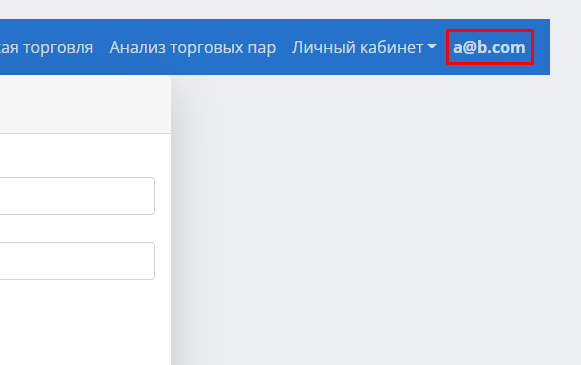
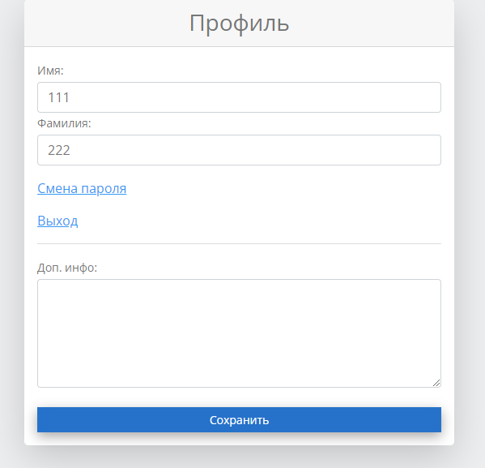

Настройки профиля
=================

После успешной авторизации в системе настройки профиля откроются, если нажать на свой адрес электронной почты в верхнем меню:

|

В появившемся окне можно отредактировать имя/фамилию/дополнительную информацию, сменить пароль или выйти из системы.

|

После внесения изменений в профиль нужно нажать кнопку **Сохранить**